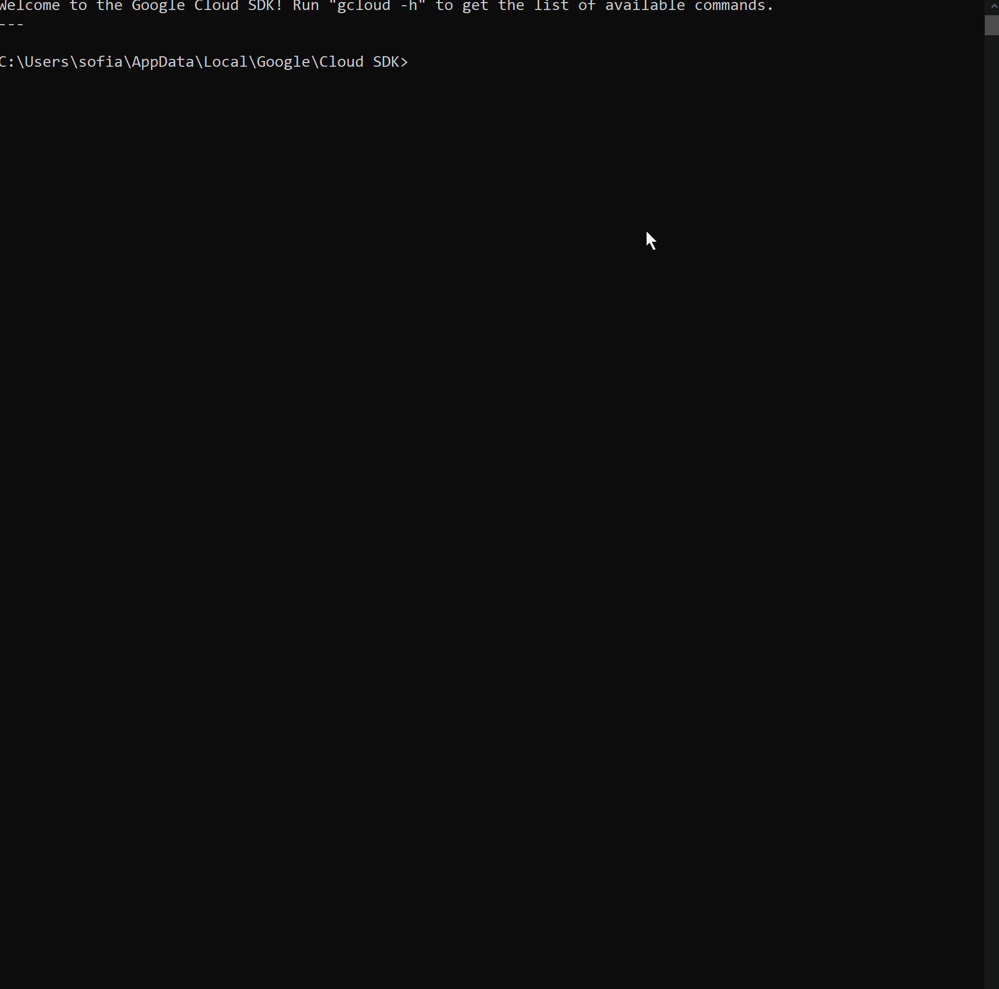
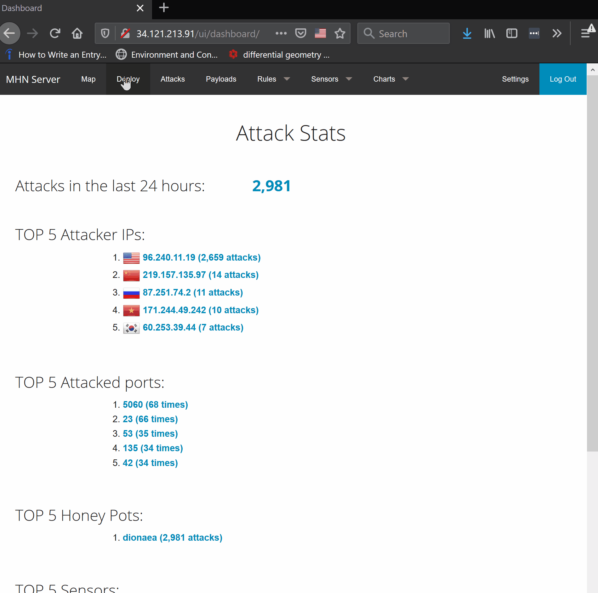

# Honeypot Assignment

**Time spent:** **12** hours spent in total

**Objective:** Create a honeynet using MHN-Admin. Present your findings as if you were requested to give a brief report of the current state of Internet security. Assume that your audience is a current employer who is questioning why the company should allocate anymore resources to the IT security team.

### MHN-Admin Deployment (Required)

**Summary:** How did you deploy it? Did you use GCP, AWS, Azure, Vagrant, VirtualBox, etc.?

The MHN-Admin Deployment was accomplished through Google Cloud Platform services via the free trial and console platform. By enabling the inbound ports for the MHN Admin and subsequently creating the virtual machine, the machine was bound to the target-tags of the firewall's rules. Upon establishing a SSH connection to the VM, the MHN Admin VM was installed to run on the remote VM.

### Dionaea Honeypot Deployment (Required)

**Summary:** Briefly in your own words, what does dionaea do?

Dionaea is the biological name for Venus flytraps, meant to symbolize the nature of a honeypot; drawing in attackers in order to trace malicious actors. The honeypot is a server side model, representing a vunerable system or device. It is based off of the original nepenthes honeypot that serves to capture worms. The Dionaea honeypot is more accessible, built by implementing the python scripting language. The honeypot is a useful tool for capturing malware and attack payloads

### Database Backup (Required) 

**Summary:** What is the RDBMS that MHN-Admin uses? What information does the exported JSON file record?

An RDBMS stands for a Relatinal Database Management System. The RSBMS that the MHN-Admin (Moden Honeypot Network Admin) uses mongodb to store its honeypot event and aggregated event data. The data is exported from the MHN-Admin and the subsequent remote MHN via a JSON file. The information recorded in the JSON file includes the attack report, which provides the attacked sensor, the data of attack, the country origin of attack, and other technical details such as the Dst port, attack protocol, and honeypot type.

*Be sure to upload session.json directly to this GitHub repo/branch in order to get full credit.*

### Deploying Additional Honeypot(s) (Optional)

These next challenges were not completed, but may be completed as an extension to the current project. Additional honeypots allow for extended capture and diversity in attacks captured. These also increase potential for capturing substansial malware, which can be further analyzed.

#### X Honeypot

**Summary:** What does this honeypot simulate and do for a security researcher?

### Malware Capture and Identification (Optional)

#### X Malware

**Summary:** How did you find it? Which honeypot captured it? What does each malware do?

MD5 Hash: *Run `md5sum` on the file and record the hash here.*

SHA1 Hash: *Run `sha1sum` on the file and record the hash here.*

## Notes

Describe any challenges encountered while doing the assignment.

There were several challenges to this assignment, among them, determining the meaning behind terminal input chunks and troubleshooting permission priviledges. For example, the initializing step for the GCP took longer than anticipated given permission requirements from the GCP account organization. In order to understand the meaning behind the various imports and understand the mechanisms for opening new terminal for the remote MHN or honeypot, outside research was required for every step in the assignment process. Perhaps most challenging was the jump in knowledge expectations from the last assignment to this current assignment.
